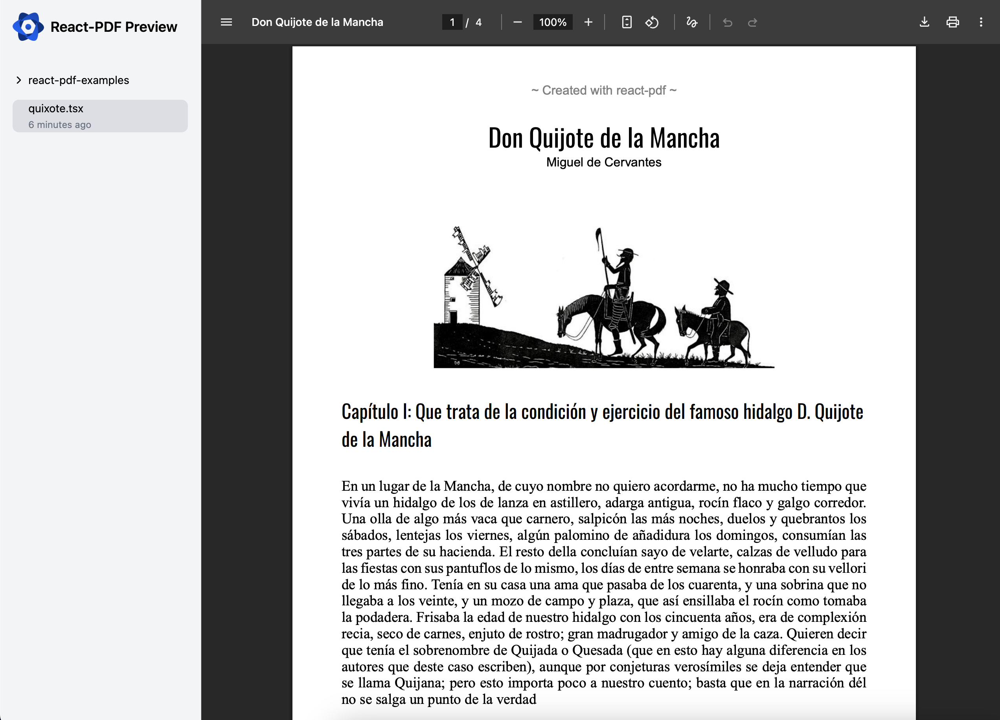

<p align="center">
  
  <p align="center">Dev server for React renderer for creating PDF files on the browser and server<p>
</p>



## How to install

```sh
pnpm install @react-pdf/preview
npm install @react-pdf/preview
yarn instal @react-pdf/preview
```

## How it works
```package.json
"scripts": {
  "dev": "react-pdf --dir=src/templates --port=3000"
}
```

## Kudos

- [@diegomura](https://github.com/diegomura) for the amazing [@react-pdf/renderer](https://github.com/diegomura/react-pdf)
- [@resend](https://github.com/resend) for the inspiration from [react-email](https://github.com/resend/react-email)

## Stack
- [Vite](https://vitejs.dev/)
- [React](https://reactjs.org/)
- [Tailwind](https://tailwindcss.com/)

## License

MIT © [Dimitar Mitov](http://github.com/dmitov)
